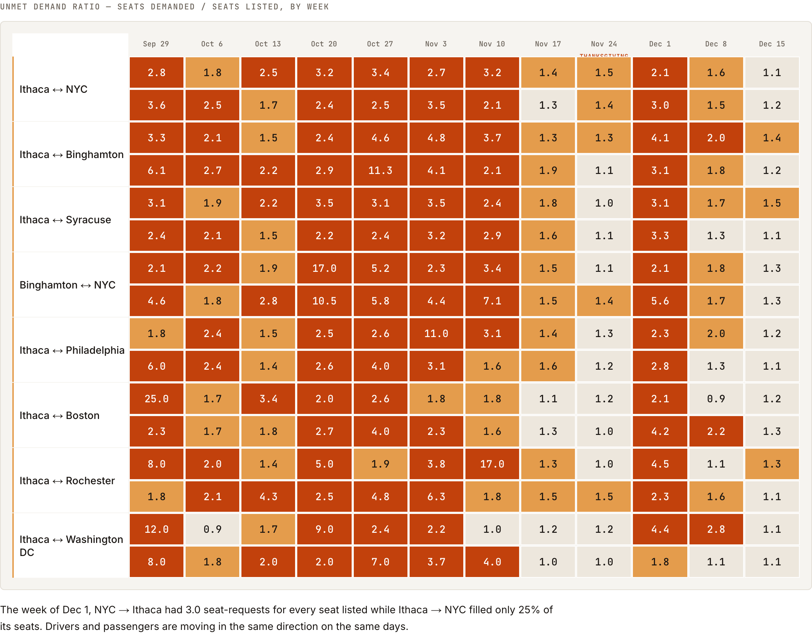
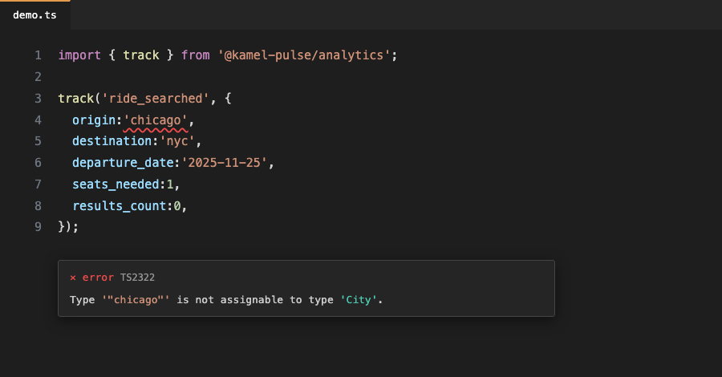

# Kamel Pulse

Corridor liquidity and trust-funnel analytics for Kamel Ride, built on a typed event pipeline.



## Why these metrics

Kamel Ride's failure mode isn't low engagement — it's unserved demand. A student searching Ithaca → NYC the Tuesday before Thanksgiving and finding zero seats looks *identical*, in a DAU chart, to one who found exactly the ride they wanted. Pageviews and session length measure activity, not whether it succeeded — disqualifying for a marketplace whose entire risk is "demand shows up and supply doesn't."

So this dashboard is built around the two events most analytics setups never add: `search_returned_empty` (demand unserved) and `ride_listing_expired` (supply unsold). Everything else — the funnel, the messaging lift, the review lift — explains *why* liquidity fails, not just what happened.

## The insight this surfaced

The heatmap pairs every corridor with its return leg on purpose. Alone, a hot Ithaca → NYC column in late November just looks like a busy corridor. Next to NYC → Ithaca the *same week* (above), it's a coordination failure: the students who need a ride out are the same people who'd otherwise drive the return leg, and almost nobody makes that trip on the day everyone needs it. One leg runs 3-to-1 oversubscribed; the other fills a quarter of its seats. Same people, wrong direction — so the fix is specific: recruit return-leg drivers for break weekends instead of waiting for supply to show up on its own.

## Event taxonomy

| Event | Fires when |
|---|---|
| `user_signed_up` | a `.edu` account verifies |
| `ride_searched` | a user searches a corridor + date |
| `search_returned_empty` | that search finds zero seats |
| `ride_listed` | a driver posts spare seats |
| `ride_viewed` | a listing is opened from results |
| `driver_profile_viewed` | a driver's profile/reviews are opened |
| `message_thread_started` | either side starts an in-app thread |
| `seat_reserved` | a passenger holds a seat |
| `booking_completed` | cost-share payment clears |
| `booking_cancelled` | either side cancels a reservation |
| `ride_listing_expired` | a listing closes with seats unsold |
| `trip_completed` | the trip happens |
| `review_submitted` | either side reviews the other |

### The two events that matter most

`search_returned_empty` and `ride_listing_expired` are two faces of one failure — unmet demand and unsold supply. Neither is derived after the fact from an absence of events; both fire explicitly, the moment the platform fails someone. A zero-result search fires both `ride_searched` (`results_count: 0`) and `search_returned_empty`, so search volume and failure volume stay independently countable.

## A note on naming

Every property is `cost_share_per_seat` — never `price`, `fare`, or `revenue`. Kamel Ride isn't a Transportation Network Company; drivers are reimbursed for gas, tolls, and wear on a trip they were already taking, not paid a fare for a service they wouldn't otherwise provide. That's a legal distinction, not a style preference.

## Architecture

```
Browser (track())
  -> packages/analytics: 20-event buffer / 3s flush / sendBeacon on unload
  -> POST /api/events (batch, max 100)
       -> Zod validates each event against its own schema
       -> hot columns lifted out of properties (origin, destination, ride_id, ...)
       -> INSERT ... ON CONFLICT (event_id) DO NOTHING
  -> Postgres `events` (append-only)
       -> `corridor_week_rollup` materialized view (refreshed by pnpm seed)
  -> src/db/queries/* -> Server Components -> the three views
```

`packages/analytics/src/events.ts` declares one discriminated union — the 13 events, each with its own property shape. `schemas.ts` builds a Zod schema per event and checks it against that same union with `satisfies`: change a field in `events.ts` without updating `schemas.ts` and the build fails. One union backs both the client's compile-time types and the server's runtime validation — not two definitions that can quietly drift.



## Data model decisions

- **Append-only.** No updates, no deletes — the event log is the source of truth, and every derived number is a query, not a stored mutation.
- **`event_id` is the primary key.** Idempotency is enforced by Postgres (`ON CONFLICT DO NOTHING`), not application logic. `/demo`'s "fire twice" button proves this with two real requests, not a mock.
- **Hot columns are denormalized out of JSONB.** Corridor and time are in the `WHERE` clause of every dashboard query; buried in `properties`, they'd force a sequential scan as the table grows.
- **`corridor_week_rollup` is a materialized view**, refreshed at the end of `pnpm seed`. The heatmap and fill-rate chart read from it, not raw events — aggregating 60k+ rows on every page load is the wrong place to pay that cost.

## Setup

Requires **Node 20 LTS** and **pnpm**. A free [Neon](https://neon.tech) Postgres project is the only external dependency.

```bash
pnpm install
cp .env.example .env.local  # paste your Neon DATABASE_URL
pnpm db:push                # create the schema
pnpm seed                   # generate + insert ~61k deterministic events
pnpm verify-seed             # optional: asserts all 8 planted findings pass
pnpm dev
```

## Deliberately out of scope

- **Auth on the ingest endpoint** — a real deployment needs a per-client write key; this one trusts any POST so `/demo` and a reviewer can hit it directly.
- **Real payments** — `cost_share_per_seat` and `amount_cents` are recorded, never charged; drivers are reimbursed off-platform today.
- **Streaming ingestion** — batched HTTP POSTs are the right scale; Kafka/Kinesis would solve a problem this dataset doesn't have.
- **Mobile app** — web-only; the schema doesn't assume a platform, so a native client could POST to the same endpoint.
- **Alerting** — findings are visualized, not paged on. First item below.

## What I'd build next

- Anomaly alerts on empty-search spikes per corridor, so a shortage is caught the week it starts.
- Automated driver-recruitment targeting, sourced from the heatmap's worst cells instead of a human scanning it.
- Per-campus liquidity thresholds as launch gates, so a third campus doesn't go live before Binghamton's numbers say it's ready.
- A schema-version migration path — `schema_version` is on every event already; nothing reads it yet.
